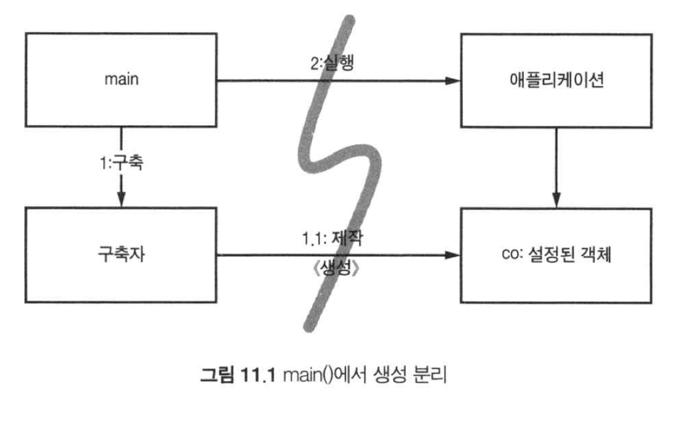
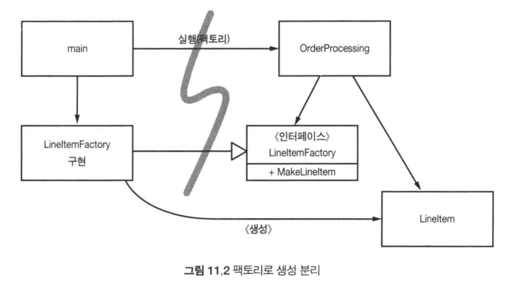
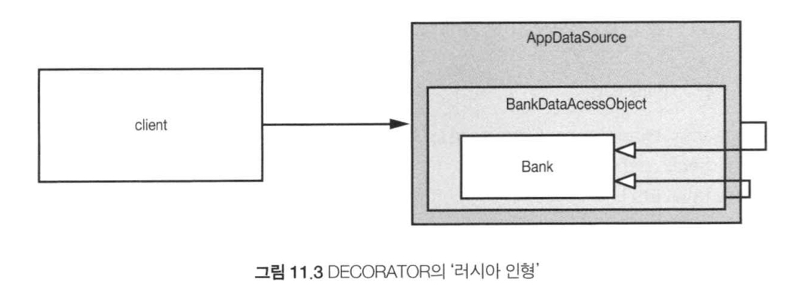

# Clean Code

## 도시를 세운다면?
- 온갖 세세한 사항을 혼자서 직접 관리할 수 있을까?
- 도시에는 큰 그림을 그리는 사람들도 있으며 작은 사항에 집중하는 사람들도 있다.
- 도시가 돌아가는 또 다른 이유는 적절한 추상화와 모듈화 때문이다.
- 큰 그림을 이해하지 못할지라도 개인과 개인이 관리하는 구성요소는 효율적으로 돌아간다.

## 시스템 제작과 시스템 사용을 분리하라
- 제작과 사용은 아주 다르다는 사실을 명심한다.
- 시작 단계는 모든 애플리케이션이 풀어야 할 관심사다.
- 관심사 분리는 우리 분야에서 가장 오래되고 가장 중요한 설계 기법 중 하나다.
- 불행히도 대다수 애플리케이션은 시작 단계라는 관심사를 분리하지 않는다.
- 준비 과정 코드를 주먹구구식으로 구현할 뿐 아니라 런타임 로직과 마구 뒤섞는다.

```java
// bad
public Service getService() {
	if (service == null)
		service = new MyServiceImpl(...); // 모든 상황에 적합한 기본값일까?
	return service;
}
```

- 초기화 지연 혹은 계산 지연 기법이라고도 부른다.
- `getService`가 `MyServiceImpl`과 생성자 인수에 명시적으로 의존한다.
- 테스트도 `getService`를 호출하기 전에 적절한 테스트 전용 객체를 service 필드 에 할당해야 한다.
- 무엇보다 `MyServiceImpl`이 모든 상황에 적합한 객체인지 모른다는 사실이 가장 큰 우려다.
- 체계적이고 탄탄한 시스템을 만들고 싶다면 흔히 쓰는 좀스럽고 손쉬운 기법으로 모듈성을 꺠서는 절대로 안 된다.

### Main 분리
- 시스템 생성과 시스템 사용을 분리하는 한 가지 방법으로, 생성과 관련한 코드는 모두 main이나 main이 호출하는 모듈로 옮기고, 나머지 시스템은 모든 객체가 생성되었고 모든 의존성이 연결되었다고 가정한다.
- 애플리케이션은 main이나 객체가 생성되는 과정을 전혀 모른다는 뜻이다.
- 단지 모든 객체가 적절히 생성되었다고 가정한다.



### 팩토리
- 때로는 객체가 생성되는 시점을 애플리케이션이 결정할 필요도 생긴다.
- 이때는 Factory Method 패턴을 사용한다.
- `OrderProcessing` 애플리케이션은 `LineItem`이 생성되는 구체적인 방법을 모른다.



### 의존성 주입
- 의존성 주입은 제어 역전 기법을 의존성 관리에 적용한 메커니즘이다.
- 한 객체가 맡은 보조 책임을 새로운 객체에게 전적으로 떠넘긴다.
- 진정한 의존성 주입은 클래스가 의존성을 해결하려 시도하지 않고, 설정자나 생성자 인수를 제공한다.
- 실제로 생성되는 객체 유형은 설정 파일에서 지정하거나 특수 생성 모듈에서 코드로 명시한다.

## 확장
- '처음부터 올바르게' 시스템을 만들 수 있다는 믿음은 미신이다.
- 대신에 우리는 오늘 주어진 사용자 스토리에 맞춰 시스템을 구현해야 한다.

### 횡단 관심사
- AOP는 횡단 관심사에 대처해 모듈성을 확보하는 일반적인 방법론이다.
- AOP에서 관점이라는 모듈 구성 개념은 '특정 관심사를 지원하려면 시스템에서 특정 지점들이 동작하는 방식을 일관성 있게 바꿔야 한다'라고 명시한다.

## 자바 프록시
- 단순한 상황에 적합하다.
- 개별 객체나 클래스에서 메서드 호출을 감싸는 경우가 좋은 예다.
- 코드의 양과 크기는 프록시의 두 가지 단점이다.
- 프록시를 사용하면 깨끗한 코드를 작성하기 어렵다.
- 또한 프록시는 시스템 단위로 실행 '지점'을 명시하는 메커니즘도 제공하지 않는다.

```java
// Bank.java (suppressing package names...)
import java.utils.*;

// The abstraction of a bank.
public interface Bank {
    Collection<Account> getAccounts();
    void setAccounts(Collection<Account> accounts);
}

// BankImpl.java
import java.utils.*;

// The “Plain Old Java Object” (POJO) implementing the abstraction.
public class BankImpl implements Bank {
    private List<Account> accounts;

    public Collection<Account> getAccounts() {
        return accounts;
    }
    
    public void setAccounts(Collection<Account> accounts) {
        this.accounts = new ArrayList<Account>();
        for (Account account: accounts) {
            this.accounts.add(account);
        }
    }
}
// BankProxyHandler.java
import java.lang.reflect.*;
import java.util.*;

// “InvocationHandler” required by the proxy API.
public class BankProxyHandler implements InvocationHandler {
    private Bank bank;
    
    public BankHandler (Bank bank) {
        this.bank = bank;
    }
    
    // Method defined in InvocationHandler
    public Object invoke(Object proxy, Method method, Object[] args) throws Throwable {
        String methodName = method.getName();
        if (methodName.equals("getAccounts")) {
            bank.setAccounts(getAccountsFromDatabase());
            
            return bank.getAccounts();
        } else if (methodName.equals("setAccounts")) {
            bank.setAccounts((Collection<Account>) args[0]);
            setAccountsToDatabase(bank.getAccounts());
            
            return null;
        } else {
            ...
        }
    }
    
    // Lots of details here:
    protected Collection<Account> getAccountsFromDatabase() { ... }
    protected void setAccountsToDatabase(Collection<Account> accounts) { ... }
}

// Somewhere else...
Bank bank = (Bank) Proxy.newProxyInstance(
    Bank.class.getClassLoader(),
    new Class[] { Bank.class },
    new BankProxyHandler(new BankImpl())
);
```

## 순수 자바 AOP 프레임워크

```xml
<beans>
    ...
    <bean id="appDataSource"
        class="org.apache.commons.dbcp.BasicDataSource"
        destroy-method="close"
        p:driverClassName="com.mysql.jdbc.Driver"
        p:url="jdbc:mysql://localhost:3306/mydb"
        p:username="me"/>
    
    <bean id="bankDataAccessObject"
        class="com.example.banking.persistence.BankDataAccessObject"
        p:dataSource-ref="appDataSource"/>
    
    <bean id="bank"
        class="com.example.banking.model.Bank"
        p:dataAccessObject-ref="bankDataAccessObject"/>
    ...
</beans>
```



- 클라이언트는 Bank 객체에서 `getAccounts()`를 호출한다고 믿지만 실제로는 Bank POJO의 기본 동작을 확장한 중첩 DECORATOR 객체 집합의 가장 외곽과 통신한다.
- 스프링 관련 자바 코드가 거의 필요 없으므로 애플리케이션은 사실상 스프링과 독립적이다.

## AspectJ 관점
- AspectJ는 언어 차원에서 관점을 모듈화 구성으로 지원하는 자바 언어 확장이다.

## 테스트 주도 시스템 아키텍처 구축
- 애플리케이션 도메인 논리를 POJO로 작성할 수 있다면, 즉 코드 수준에서 아키텍처 관심사를 분리할 수 있다면, 진정한 테스트 주도 아키텍처 구축이 가능해진다.
- 그때그때 새로운 기술을 채택해 단순한 아키텍처를 복잡한 아키텍처로 키워갈 수도 있다.
- '아주 단순하면서도' 멋지게 분리된 아키텍처로 소프트웨어 프로젝트를 진행해 결과물을 재빨리 출시한 후, 기반 구조를 추가하며 조금씩 확장해 나가도 괜찮다.
- 프로젝트를 시작할 때는 일반적인 범위, 목표, 일정은 물론이고 결과로 내놓을 시스템의 일반적인 구조도 생각해야 한다. 하지만 변하는 환경에 대처해 진로를 변경할 능력도 반드시 유지해야 한다.

## 의사 결정을 최적화하라
- 모듈을 나누고 관심사를 분리하면 지엽적인 관리와 결정이 가능해진다.
- 우리는 때떄로 가능한 마지막 순간까지 결정을 미루는 방법이 최선이라는 사실을 까먹곤 한다.

## 명백한 가치가 있을 때 표준을 현명하게 사용하라.
- 표준을 사용하면 아이디어와 컴포넌트를 재사용하기 쉽고, 적절한 경험을 가진 사람을 구하기 쉬우며, 좋은 아이디어를 캡슐화하기 쉽고, 컴포넌트를 엮기 쉽다.

## 시스템은 도메인 특화 언어가 필요하다.
- 좋은 DSL은 도메인 개념과 그 개념을 구현한 코드 사이에 존재하는 '의사소통 간극'을 줄여준다.
- 효과적으로 사용한다면 DSL은 추상화 수준을 코드 관용구나 디자인 패턴 이상으로 끌어올린다.

## 결론
- 깨끗하지 못한 아키텍처는 도메인 논리를 흐리며 기민성을 떨어뜨린다.
- 도메인 논리가 흐려지면 제품 품질이 떨어진다.
- 기민성이 떨어지면 생산성이 낮아져 TDD가 제공하는 장점이 사라진다.
- 모든 추상화 단계에서 의도는 명확히 표현해야 한다. 그러려면 POJO를 작성하고 관점 혹은 관점과 유사한 메커니즘을 사용해 각 구현 관심사를 분리해야 한다.
- 시스템을 설계하든 개별 모듈을 설계하든, 실제로 돌아가는 가장 단순한 수단을 사용해야 한다는 사실을 명심하자.
